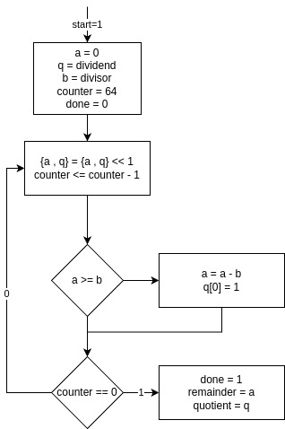

<div dir='rtl'>

- [تمرین ۱](<#تمرین-۱>)

# سیستم داوری تمرینات عملی درس معماری کامپیوتر

## برنامه های پیشنیاز

برای اجرای این سامانه، به برنامه های زیر نیازمندید :

</div>

    # iverilog
    # python (python-is-python3)
    # ubuntu/debian (apt) :
    sudo apt install iverilog python3 python-is-python3
    # arch (pacman)
    sudo pacman -S iverilog python

<div dir='rtl'>

### نحوه کارکرد سامانه داوری

سامانه داوری به طور کلی از ۲ جزء تشکیل شده است :

1. اسکریپت های کمک کننده :
   - <code dir='ltr'>./synthesize.sh</code> :
     این اسکریپت توصیف مدار شما را به کد وریلاگ سنتز میکند.
     این توصیف سنتز شده در پوشه
     <code dir='ltr'>~/logisim_evolution_workspace/</code> قرار میگیرد.
   - <code dir='ltr'>./validate.sh</code> :
     این اسکریپت با گرفتن تست بنچ داده شده (مربوط به همان سوال)
     و محل قرار گیری توصیف سنتز شده، مدار طراحی شده را آزمایش میکند و به آن نمره میدهد.
   - <code dir='ltr'>./synth_valid.sh</code> :
     این اسکریپت عملا ترکیب دو اسکریپت قبلی است و ابتدا فرایند سنتز را انجام میدهد و سپس
     خروجی سنتز را ارزیابی میکند.
2. فایل های تست بنچ :
   این فایل ها شامل منطق ساخت تست های مختلف و بررسی صحت مدار شما میباشند.
   با توجه به این که این فایل ها منطق نمره دهی را شامل میشوند، شما میتوانید مشکل مدارات خود را رفع کنید.

## تمرین ۱

در این تمرین شما یک
جمع/تفریق کننده ۴ بیتی طراحی
می‌کنید.

درگاه های این مدار عبارتند از :

</div>

    input [3:0]a
    input [3:0]b
    input sub_notadd
    output [3:0]s
    output cout

<div dir='rtl'>
با توجه به آموخته هایتان در دروس گذشته، چنین مداری را
    میتوان به شکل زیر توصیف نمود :
</div>

    sub_notadd  :    {cout , s} = a + b
    !sub_notadd :    {cout , s} = a + ~b + 1

<div dir='rtl'>

ارزیابی این تمرین با دستور زیر انجام میشود :

</div>

    ./synth_valid.sh ./HW1/bench.circ ./HW1/tb0.v

<div dir='rtl'>
با توجه به این که این تمرین اول است،
    صرفا جنبه دست گرمی و استفاده از سیستم داوری دارد،
    پاسخ آن عملا در فایل
    <code dir='ltr'>HW1/bench.circ</code>
    موجود است و صرفا شما باید در گزارشتان آنرا اجرا و بررسی کنید.
    البته با توجه به این که در ادامه درس با مدارات بسیار پیچیده تر
    مواجه خواهید شد، توصیه اکید من این است که شما یک دور دست خود
    را برای استفاده از
    <code dir='ltr'>logisim</code>
    گرم کنید و این مدار را به روش خود طراحی کنید.

## تمرین ۲

### سوال ۱

مداری طراحی کنید که طبق دستورات زیر کار کند :

</div>

```
load:   rl <= in1
0:      r2 <= -r1
1:      r2 <= r1 & r2
2:      r2 <= -r2
3:      out1 <= r1 + r2
        r2   <= r1 + r2
```

<div dir='rtl'>

درگاه های این مدار عبارتند از :

</div>

    input [31:0]in1
    input load
    input clk
    output [31:0]out1

<div dir='rtl'>

ارزیابی این تمرین با دستور زیر انجام میشود :

</div>

    ./synth_valid.sh schematic.circ ./HW2/tb1.v

<div dir='rtl'>

### سوال ۲

مطابق فلو چارت زیر، مدار مورد نظر را طراحی کنید:

<center>


توجه کنید که منظور از {a,q} این است که
بیت های a را سمت چپ(جایگاه پر ارزش تر) بیت های
q قرار میدهیم.

</center>
درگاه های این مدار عبارتند از :

</div>

    input [31:0]divisor
    input [31:0]dividend
    input start
    input clk
    output [31:0]quotient
    output [31:0]remainder
    output done

<div dir='rtl'>

ارزیابی این تمرین با دستور زیر انجام میشود :

</div>

    ./synth_valid.sh schematic.circ ./HW2/tb2.v
