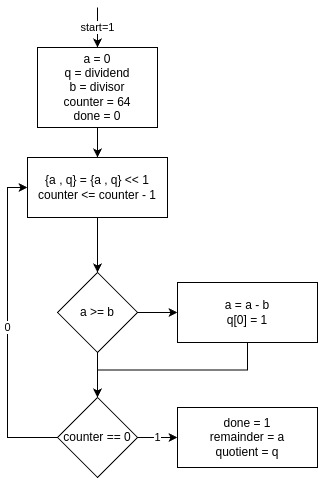

[Persian version](Readme-fa.md)

# Computer Architecture Course, Practical Homework Grading System

## Prerequisites

To run this system, you will need the following programs:

```bash
# iverilog
# python (python-is-python3)
# ubuntu/debian (apt):
sudo apt install iverilog python3 python-is-python3
# arch (pacman)
sudo pacman -S iverilog python
```

### How the Grading System Works

The grading system consists of two main components:

1. **Helper Scripts**:

   - `./synthesize.sh`:
     This script synthesizes your circuit description into Verilog code.
     The synthesized description is placed in the `~/logisim_evolution_workspace/` directory.
   - `./validate.sh`:
     This script takes the given test bench (related to the specific question)
     and the location of the synthesized description, tests the designed circuit, and assigns a score.
   - `./synth_valid.sh`:
     This script essentially combines the two previous scripts. It first performs the synthesis process and then evaluates the synthesized output.

2. **Test Bench Files**:
   These files contain the logic for creating various tests and verifying the correctness
   of your circuit. Since these files include the scoring logic, you can use them to debug and fix issues in your circuits.

## Homework 1

In this homework, you will design a 4-bit adder/subtractor.

The ports of this circuit are as follows:

```verilog
input [3:0] a
input [3:0] b
input sub_notadd
output [3:0] s
output cout
```

Based on what you have learned in previous courses, such a circuit can be described as follows:

```verilog
sub_notadd  :    {cout , s} = a + b
!sub_notadd :    {cout , s} = a + ~b + 1
```

The evaluation of this exercise is done with the following command:

```bash
./synth_valid.sh ./HW1/bench.circ ./HW1/tb0.v
```

Since this is the first exercise, it is primarily intended for practice
and familiarization with the grading system. The answer is essentially provided
in the file `./HW1/bench.circ`, and you only need to execute and review it in your report.
However, given that you will encounter much more complex circuits later in the course,
I strongly recommend that you take this opportunity to get comfortable with using `logisim` and design this circuit on your own.

## Homework 2

### Question 1

Design a circuit that operates according to the following instructions:

```
load:   rl <= in1
0:      r2 <= -r1
1:      r2 <= r1 & r2
2:      r2 <= -r2
3:      out1 <= r1 + r2
        r2   <= r1 + r2
```

The ports of this circuit are as follows:

```verilog
input [31:0] in1
input load
input clk
output [31:0] out1
```

The evaluation of this question is done with the following command:

```bash
./synth_valid.sh schematic.circ ./HW2/tb1.v
```

### Question 2

Design the circuit according to the flowchart below:

<center>


Note that {a,q} means placing the bits of `a` to the left (more significant bits) of the bits of `q`.

</center>

The ports of this circuit are as follows:

```verilog
input [31:0] divisor
input [31:0] dividend
input start
input clk
output [31:0] quotient
output [31:0] remainder
output done
```

The evaluation of this question is done with the following command:

```bash
./synth_valid.sh schematic.circ ./HW2/tb2.v
```
